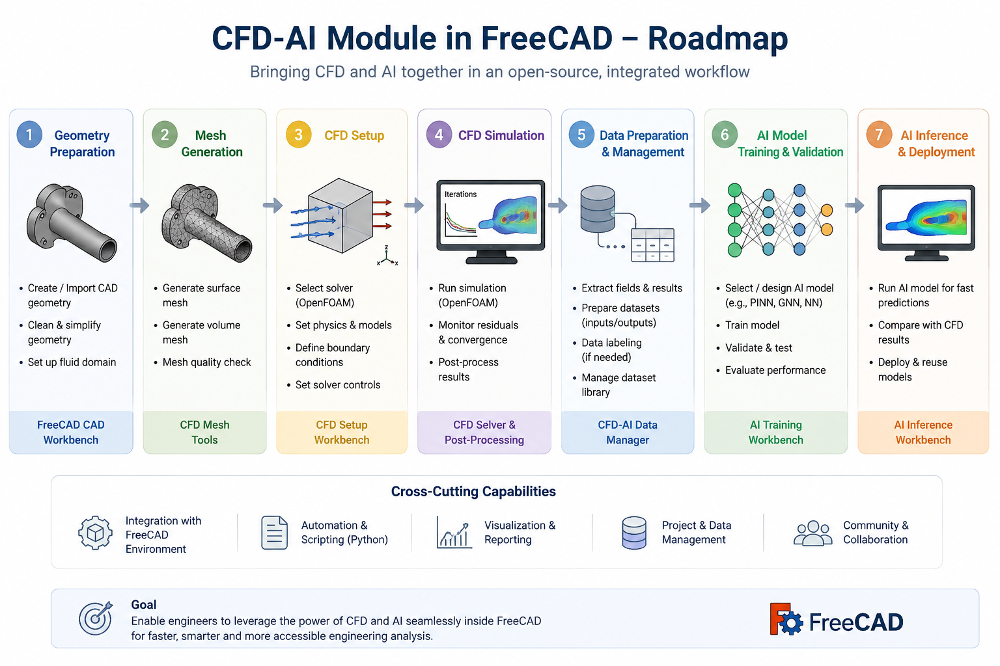
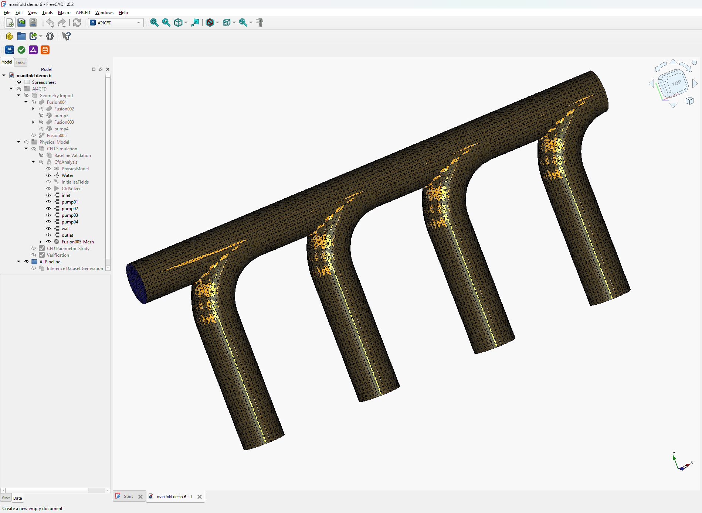
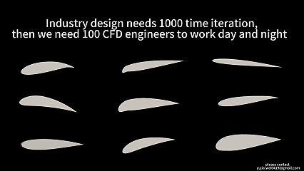

I believe this is the first open-source physical-AI toolkit embedded directly inside FreeCAD. I built it to be genuinely user-friendly — approachable enough to drop into any CFD project, not just the ones I had in mind when I wrote it.

<!--more-->

## Why This Exists

High-fidelity CFD is powerful, but it's slow — a single run can take hours, which makes it a poor fit for design optimization, where you need to evaluate hundreds of variants to find the best one. That's the bottleneck this project is built to remove, using a deep-learning surrogate model in place of the slow inner loop.

Here's the idea: you define a baseline geometry and the parameters you want to vary, and the pipeline automatically batches out the CFD simulations for you. Those results become the training data for a supervised model that learns to predict the flow field directly. Accuracy is tracked against a held-out test set, so the model holds up whether you're interpolating within the design space or pushing out toward its edges — and once it's trained, a prediction comes back in well under a second, regardless of how complex the underlying model is.

## Features

- **Physics-informed AI** — surrogate model trained on CFD results for fast hydrodynamic prediction
- **Automated design space search** — explores geometric parameters to find optimal configurations
- **FreeCAD integration** — runs entirely within the FreeCAD environment, no external solver setup required

## Software UI

I put real effort into the interface so it's approachable — you shouldn't need a machine-learning background to train your first AI surrogate model.

## Geometry Variation

Thousands of geometry variations can be generated automatically with generative AI — including shapes an engineer probably wouldn't think to draw by hand (myself included). These variations become the baseline geometries that get batched through CFD automatically, giving the model solid ground-truth data to learn from.

## Deep Learning Model

Under the hood, the software ships with several state-of-the-art architectures baked in — the Transolver family, AB-UPT, and Point-Mamba among them. Fine-tune whichever one fits your problem best and see what works for you. *(Proper citations for these to be added here.)*

## Inference

Once trained, the surrogate model can predict flow fields for brand-new geometry in seconds, no matter how unusual the shape looks. Speed and accuracy together are really the whole point of going down the AI route in the first place.



## Software Demo

I've also put together a short walkthrough showing the software in action:

